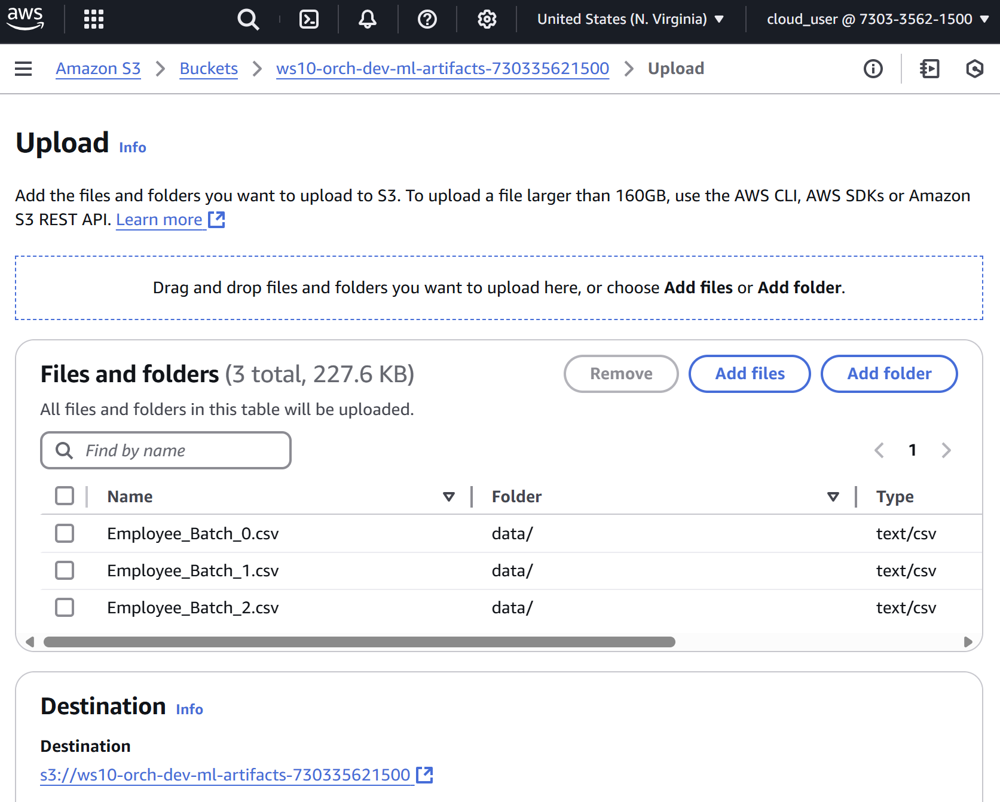
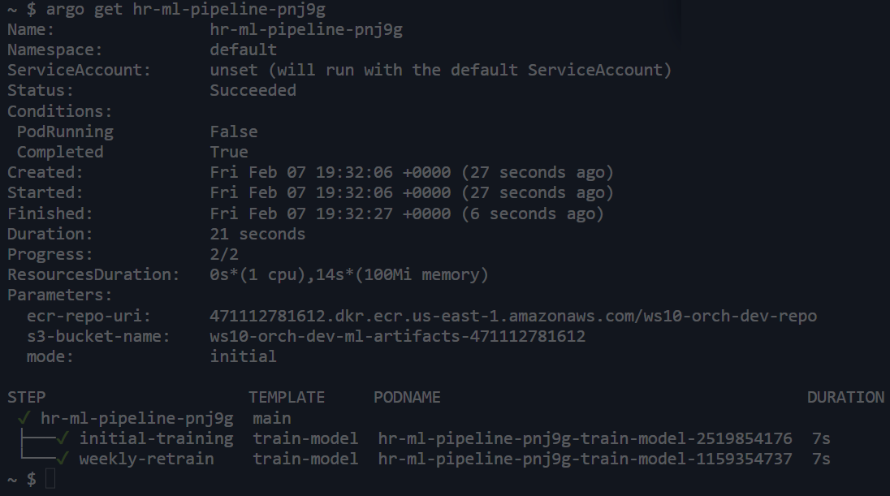

# Data Engineer Workshop 10: Conducting Your Data Orchestration

## ⚙️ Task 2: Deploying and Testing the Orchestration Workflow 🚀

## Overview

In this task, you will deploy and test an orchestration workflow using **Argo Workflows** on your **EKS cluster**. This will tie together the infrastructure resources from **Task 1**, your **Docker container** for the ML pipeline, and your orchestration logic. You will:

1. Upload the **HR data files** to your S3 bucket.
2. Push the **ML container** to your ECR repository.
3. Deploy **Argo Workflows** to the EKS cluster.
4. Submit and verify the workflow execution.
5. Review the predictions generated for HR.

## Step 0: Understanding the internals of the argo workflow YAML file

In the repo that you cloned, look inside __argo/hr-ml-pipeline.yaml__:

| Template | Purpose | What It Does |
| --- | --- | --- |
| **`main`** | **Orchestration** | Decides which tasks run and in what order. |
| **`train-model`** | **Execution Unit** | Defines the specific container that runs the Python script. |

✅ **In short:**

-   **`main`** is the *conductor* of the workflow.
-   **`train-model`** is the *actual work being done* inside a container.
-   `main` **calls** `train-model`, passing it all required parameters.

* * * * *

**Why Not Just Use `train-model` Directly?**
------------------------------------------------

You might wonder: **"Why do we need `main`? Can't we just submit `train-model`?"**

Yes, but **separating orchestration (`main`) from execution (`train-model`) has major benefits**:\
✅ **Flexibility** -- In the future, `main` could orchestrate **multiple tasks** (e.g., data validation, training, deployment).\
✅ **Scalability** -- If you need **parallel jobs** or **dependencies**, `main` can handle it.\
✅ **Readability** -- Learners and engineers can **easily see the workflow structure** and modify it.

* * * * *

**How `main` and `train-model` Work Together**
--------------------------------------------------

🔹 **When you submit the workflow**, Argo starts at `main`.\
🔹 `main` tells Argo:

-   "Run `train-model` **with these parameters**."\
    🔹 Argo then **spins up a container** using the `train-model` template, passing the correct parameters.\
    🔹 The **Python script inside the container runs the ML training process**.

## Step 1: Upload the Data to S3

To simulate real-world weekly updates, the `data/` folder includes:
- `Employee_Batch_0.csv` (initial dataset),
- `Employee_Batch_1.csv` and `Employee_Batch_2.csv` (weekly updates).


Copy the `data/` folder in your repository into your newly created S3 bucket (ws10-orch-dev-ml_articacts-XXXX).
You should see all three .csv files listed.

**Important: do not accidentally upload the csv files into the root of the bucket rather than copying the entire data folder. The csv files need to sit in the "data" folder**.

The end result should look as follows:



Remember to click Upload at the bottom of the screen or nothing will hapen!

## Step 2: Push the ML Container to ECR
The ML container contains the logic from train_model.py, which processes the datasets, trains the model, and outputs predictions.

We suggest you work in a cloud shell (e.g., AWS CloudShell, select this from the search box).

Clone the WS10 repository directly.

```
git clone https://github.com/anabottura/DE-workshop-10-Learner-AB.git
> Cloning into `YOUR-REPOSITORY`...
```

Now cd into our docker folder and build the image

```
cd DE-workshop-10-Learner-AB/docker/
docker build -t ws10-orch-dev-repo .
```

Now:
- Retrieve the ECR Repository URI

After deploying the CloudFormation stack, navigate to the Outputs tab in the AWS CloudFormation Console Look for the EcrRepoUri output, which should look something like:
__654654587449.dkr.ecr.us-east-1.amazonaws.com/ws10-orch-dev-repo__

You could copy this ECR Repo URI to a notepad, but you don't have to. Why? Keep reading.

Now this is really cool: Instead of accessing your copied URI from your notepad, ECR URI can be retrieved automatically with the value of EcrRepoUri from the CloudFormation outputs. You need to remember how you named your stack (most likely __hr-ml-stack__, which is a name we chose in Task 1). Now see below how to use the retrieved value to **authenticate Docker with the ECR repository and push the Docker Image:**

```
#N.B. The following command will only work after CF finished deploying all the resources. 
#At that point "Outputs" become available in CF. 
# Adjust if your stack name is different from ‘hr-ml-stack’.

export ECR_URI=$(aws cloudformation describe-stacks --stack-name hr-ml-stack \
--query "Stacks[0].Outputs[?OutputKey=='EcrRepoUri'].OutputValue" --output text)

aws ecr get-login-password --region us-east-1 | docker login --username AWS --password-stdin $ECR_URI
docker tag ws10-orch-dev-repo:latest $ECR_URI:latest
docker push $ECR_URI:latest
```

**Wait! so what have I done exactly???**
**Purpose:**
_The primary function of docker push is to transfer a Docker image (created from a Dockerfile) from your local machine to a remote registry._
**Registry:**
_A Docker registry is a centralised storage system for container images. Docker Hub is a common public registry, but you can also use private registries like Amazon ECR, which we just did!_

To Verify the Push, Go to the ECR Console in AWS. You may have to wait a minute for it to appear.

Navigate to the repository ws10-orch-dev-repo. You may have to refresh it once inside.

Confirm that your image has been pushed successfully (image tag: latest).

The digest (sha256 hash key) should be the same as the one printed in your console when pushing the image.

__**👨‍🎓👨‍🎓👨‍🎓For learners aiming for a distinction, we recommend that you read more about hashing, hash functions and secure hash algorithms, in your own time!👨‍🎓👨‍🎓👨‍🎓**__


## Step 3: Deploy Argo Workflows


**Recommended: open a new CloudShell tab here.**

- In a new CloudShell tab, continue by installing [Helm](https://helm.sh), the package manager for Kubernetes

```
curl https://raw.githubusercontent.com/helm/helm/master/scripts/get-helm-3 > get_helm.sh
chmod 700 get_helm.sh
./get_helm.sh
```

- You will now need to ask AWS to create a KUBECONFIG file for you, it's a Kubernetes configuration file that will be used by Kubernetes-enabled services to read your cluster defaults. To do this, use the command __aws eks update-kubeconfig --region YOUR_REGION --name CLUSTER_NAME__, for example:

```
aws eks update-kubeconfig --region us-east-1 --name ws10-orch-eks-dev
```
Remember to change the region and cluster name to fit your actual values.

- Now you can add **argo** repo to Helm and install argo.

```
helm repo add argo https://argoproj.github.io/argo-helm
helm repo update
helm install argo argo/argo-workflows --namespace argo --create-namespace
```

Congratulations! You installed **Argo Workflows** on your **Kubernetes cluster**, which means: ✅ **The Argo Workflow Controller** is running inside your cluster.

✅ **Argo's UI, API, and workflow engine** are now available inside Kubernetes.


Now verify the installation

```bash
kubectl get pods -n argo
kubectl logs -n argo -l app=workflow-controller
```

You should see pods like argo-server and workflow-controller running. ✅ But **this does NOT install the Argo CLI on your local machine.** You still need to install the Argo CLI (command line interface) to leverage all of Argo's functionality from the shell:

```
# Detect OS
ARGO_OS="darwin"
if [[ uname -s != "Darwin" ]]; then
  ARGO_OS="linux"
fi

# Download the binary
curl -sLO "https://github.com/argoproj/argo-workflows/releases/download/v3.6.2/argo-$ARGO_OS-amd64.gz"

# Unzip
gunzip "argo-$ARGO_OS-amd64.gz"

# Make binary executable
chmod +x "argo-$ARGO_OS-amd64"

# Move binary to path
sudo mv "./argo-$ARGO_OS-amd64" /usr/local/bin/argo

# Test installation
argo version
```

Before proceeding, you'll apply a configuration file that fixes a permissions error in your Kubernetes cluster. This file grants the default service account the necessary rights to create and manage the _workflowtaskresults_ resource required by Argo Workflows. Without these permissions, you'll encounter a forbidden error that stops your workflows from running.

In your terminal, run:

```
kubectl apply -f DE-workshop-10-Learner-AB/argo/argo-rbac.yaml
```

After applying the file, your workflow should run without issues. (RBAC in the file name above stands for Role-Based Access Control, which is the logic that Kubernetes uses to manage permissions.)


## Step 4: Deploying and Submitting the Workflow


** What is meant by ephemeral storage and how is it different from S3**

Each workflow uses ephemeral storage by default. This means data generated by the containers inside the workflow will be lost when the pod terminates. However, since the ML pipeline fetches datasets from S3 on each run, we do not risk losing any important data in this use case. The "experimental" directory contains some inspiration should you want to experiment with other types of persistent (non-ephemeral) storage (in your own time).


- **Side-note: Deploying the Workflow without argo (using `kubectl apply`):**\

    _It is important to understand the differences between "deploying" and "submitting" the workflow. In standard kubernetes, without argo, you would deploy, i.e. upload the entire workflow definition to your Kubernetes cluster using a standard Kubernetes command:_

    `kubectl apply -f DE-workshop-10-Learner-AB/argo/hr-ml-pipeline.yaml`

    _Essentially, after kubectl apply → Nothing happens, it just gets "deployed" or "stored"_


**Actually submitting and running the Workflow using `argo submit`:**

    The _submit_ method is provided by the Argo CLI and allows for dynamic parameter substitution. When you submit a workflow, not only does it get deployed (ephemerally), you can also override default parameters at runtime without modifying the YAML file. Most importantly, submitting is what actually kicks off your job (makes it run).
    (__NB. If you've been experimenting with modifying the YAML file in the previous step, remember to change the workflow name parameter back from 'name' to 'generateName'__). 
    
    To submit the workflow, you will need to fetch two parameters from CloudFormation outputs (S3 identifier for the data bucket, and the URI for your ECR):

      ```
        # 1) Fetch CloudFormation outputs
        # REMINDER: Edit the stack name if it differs from the one below!
        # Adjust if your stack name is different from ‘hr-ml-stack’.

        ECR_REPO_URI=$(aws cloudformation describe-stacks \
            --stack-name hr-ml-stack \
            --query "Stacks[0].Outputs[?OutputKey=='EcrRepoUri'].OutputValue" \
            --output text)

        S3_BUCKET_NAME=$(aws cloudformation describe-stacks \
            --stack-name hr-ml-stack \
            --query "Stacks[0].Outputs[?OutputKey=='S3BucketName'].OutputValue" \
            --output text)

       # 2) Submit the workflow, overriding default parameters, with the initial setting

        argo submit DE-workshop-10-Learner-AB/argo/hr-ml-pipeline.yaml \
            -p ecr-repo-uri=${ECR_REPO_URI} \
            -p s3-bucket-name=${S3_BUCKET_NAME} \
            -p mode=initial
      ```

    This command submits the workflow to the cluster and sets the `mode` parameter to `"initial"`, even if the YAML file has a different default value.

    Later, you will run the weekly mode instead of the initial mode: 

    ```
    argo submit DE-workshop-10-Learner-AB/argo/hr-ml-pipeline.yaml \
          -p ecr-repo-uri=${ECR_REPO_URI} \
          -p s3-bucket-name=${S3_BUCKET_NAME} \
          -p mode=weekly
    ```

    (This command submits the workflow to the cluster and sets the `mode` parameter to `"weekly"`, even if the YAML file has a different default value.)

  **Key Points:**
  -   Runtime parameters make it easy to experiment with different scenarios.
  -   You can quickly switch between "initial" and "weekly" modes without editing the file.


### Monitoring Your Workflow

You will need to monitor the workflow and the underlying pods. Use these commands to help with that:

-   **List Active Workflows:**

    `argo list`

-   **Get Details of a Specific Workflow:**\
    Replace `<workflow-name>` with the name of the workflow from the list:

    `argo get <workflow-name>`

-   **Check Pod Status (for troubleshooting):**


    `kubectl get pods --all-namespaces`

    If you see that any of your pods are stuck in __pending__ state, you will need to troubleshoot by referring to the stuck pod, for example :

      `kubectl describe pod hr-ml-pipeline-f8hbz-train-model-3686676410 -n default`

    Once you fix any underlying issues, you can retry your workflow:

      `argo retry <workflow-name>`


### Deep-dive into our HR Logic and Context

-   **HR Logic Overview:**\
    Review the Python code for the model and reflect on what it does https://github.com/anabottura/DE-workshop-10-Learner-AB/docker/train_model.py :

    The workflow is built around this code. In **initial mode**, the workflow uses historical HR data to build a baseline model. In **weekly mode**, it incorporates new data updates (such as changes in employee records) to retrain the model and keep predictions current.

-   **Experimenting with Modes:**\
    By using the Argo CLI's runtime parameter substitution, you can easily switch between modes:

    -   Use `argo submit` to test how the model performs with only historical data (initial training).
    -   Switch to weekly mode to simulate a dynamic environment where the model updates as new HR data arrives.

These experiments will give you practical insight into how orchestration and continuous retraining work in a production-like setting.

**To troubleshoot what could be going wrong inside a running container, use something like:**

```
kubectl logs -n default hr-ml-pipeline-fhbq5-train-model-2153528862 -c main
```

Where the long name is the name of the kubernetes pod in which your workflow task is running.

## Step 5: Verify the output

When the job finishes, using `argo get` should show you an output similar to the image below (notice the "Succeeded" status and the green ticks at the bottom.).



Next, Check Predictions in S3. Navigate to the S3 Console.

The _output_ directory should now have been created in your bucket! Verify the presence of **_output/attrition_predictions.csv_** in the bucket (e.g in _ws10-orch-dev-ml-artifacts-654654587449_.)

Read inside the fie and think about how a Data Scientist would approach these results. Think about how you would collaborate with Data Scientists as a Data Engineer. Then think about how the business/HR would approach these results. Think about how you would collaborate with the business/HR as a Data Engineer.  How can these results be used to inform business strategy

You will also want to inspect your Workflow Logs:

```
argo logs <workflow-name>
```

## Summary
In this task, you have:

- Uploaded the datasets to S3.
- Built and pushed the Docker image to ECR.
- Deployed Argo Workflows to your EKS cluster.
- Executed and verified the ML orchestration pipeline.
- This demonstrates a complete end-to-end orchestration setup, simulating a real-world ML workflow.

Well done and Happy k8s'ing! (__k8s__ is a short-hand for __kubernetes__, as the word __kubernetes__ has 8 letters in the middle, between the initial __k__ and the trailing __s__.)